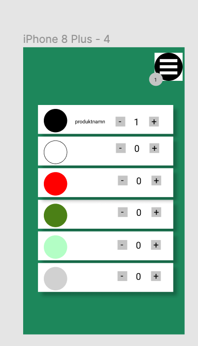
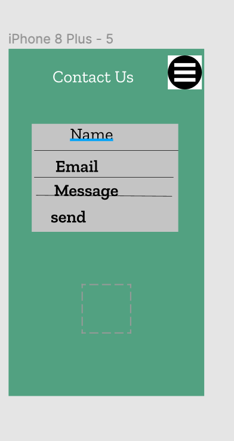

<!-- .slide: class="intro" -->

## TDD project Grupp11

### Unit testing in Vue with JEST

###### Members involved in this project

- krishna Mohan paruchuri <!-- .element: class="fragment" -->
- Surya Chitturi <!-- .element: class="fragment" -->
- Oskar <!-- .element: class="fragment" -->
- Sinny <!-- .element: class="fragment" -->
- Razieh <!-- .element: class="fragment" -->

Note: tryck S för att öppna speaker view

---

<!-- .slide: class="complex pink" -->

## Tools we used for this project <!-- .element: class="fragment" -->

- Figma <!-- .element: class="fragment" -->
- Trello board <!-- .element: class="fragment" -->
- Scrum methodology <!-- .element: class="fragment" -->
- git version system <!-- .element: class="fragment" -->
- Vue Webframe work <!-- .element: class="fragment" -->
- Jest for unit testing <!-- .element: class="fragment" -->

---

<!-- .slide: class="complex pink" -->

## Figma sketches (1)

Products list in ProductPage <!-- .element: class="fragment" -->

 <!-- .element: class="fragment" height="450pt" width="30%" style="font-size: 0.4em !important;" -->

---

<!-- .slide: class="complex pink" -->

## Figma sketches (2)

Contact us page <!-- .element: class="fragment" -->

 <!-- .element: class="fragment" height="450pt" style="font-size: 0.4em !important;" -->

---

<!-- .slide: class="complex pink" -->

## Trello Board

- As a user/developer, i want to able to see products with info so that i can easily choose. <!-- .element: class="fragment" style="font-size: 0.8em !important;" -->
- As a developer, we have to render the list of items on product page. <!-- .element: class="fragment" style="font-size: 0.8em !important;" -->
- As a devloper, we have to test that axios is fetching the products as per the functionality. <!-- .element: class="fragment" style="font-size: 0.8em !important;" -->
- As a user/developer, we have to add/remove the products from the CartItem. <!-- .element: class="fragment" style="font-size: 0.8em !important;" -->
- As a user/developer, we have to test that The routes are working properly. <!-- .element: class="fragment" style="font-size: 0.8em !important;" -->

---

<!-- .slide: class="complex pink" -->

## Agile Methodology (1)

- Accommodate changing requirements throughout the development process. <!-- .element: class="fragment" style="font-size: 0.8em !important;" -->
- Support, trust, and motivate the people involved. <!-- .element: class="fragment" style="font-size: 0.8em !important;" -->
- Enable face-to-face interactions. <!-- .element: class="fragment" style="font-size: 0.8em !important;" -->
- To support a consistent development pace. <!-- .element: class="fragment" style="font-size: 0.8em !important;" -->
- Code reviews and finishing the task according to the plan. <!-- .element: class="fragment" style="font-size: 0.7em !important;" -->
- Checking the status of the project day to day progress. <!-- .element: class="fragment" style="font-size: 0.8em !important;" -->
- Conducting meetings or interacting through discord. <!-- .element: class="fragment" style="font-size: 0.8em !important;" -->

---

<!-- .slide: class="complex pink" -->

## Agile Methodology (2)

### How much time spent on each module

| Module               | Time in (hrs) |
| :------------------- | :------------ |
| Designing the layout | 6 hrs         |
| Trello               | 4-6 hrs       |
| Daily Scrum Meetings | 36 hrs        |
| Pair coding          | 24 hrs        |
| Code reviews         | 8 hrs         |
| Unit Testing         | 24 hrs        |
| Git                  | 24hrs         |
| Presentation         | 8 hrs         |
| Total hrs            | 136 hrs       |

<!-- .element: class="fragment" style="font-size: 0.6em !important;" -->

---

<!-- .slide: class="complex pink" -->

## Vue Frame work

#### presentation of the project

-http://localhost:8080/ <!-- .element: class="fragment" style="font-size: 0.9 em !important;" -->

---

<!-- .slide: class="complex pink" -->

### Testing code Examples with Jest (Axios)

```javascript
import { shallowMount } from "@vue/test-utils";
import ProductPage from "@/views/ProductPage.vue";

jest.mock("axios", () => ({
  get: () => Promise.resolve({ data: [{ val: 1 }] }),
}));

describe("products", () => {
  test("mocking the axios call to get products shuold work", async () => {
    const wrapper = shallowMount(ProductPage);
    await wrapper.vm.$nextTick();
    expect(wrapper.vm.products.length).toBe(1);
  });
});
```

---

<!-- .slide: class="complex pink" -->

### Testing code Examples with Jest (Vue Router)

```javascript
import { mount, createLocalVue } from "@vue/test-utils";
import App from "@/App.vue";
import VueRouter from "vue-router";
import ProductPage from "@/views/ProductPage.vue";
import routes from "@/routes.js";

const localVue = createLocalVue();
localVue.use(VueRouter);

describe("App", () => {
  it("renders a child component via routing", async () => {
    const router = new VueRouter({ routes });
    const wrapper = mount(App, {
      localVue,
      router,
    });

    router.push("/products");
    await wrapper.vm.$nextTick();

    expect(wrapper.findComponent(ProductPage).exists()).toBe(true);
  });
});
```

---

<!-- .slide: class="complex pink" -->

## Links for the repo

- https://github.com/krishnamohanparuchuri/webshop_tdd_grup11

- https://trello.com/b/0E9CRt5B/group-11

- https://www.figma.com/file/XXiVFZf2nEBS3yLR0H06F3/vue-TDD?node-id=0%3A1

---

<!-- .slide: class="complex pink" -->

## Any questions ? <!-- .element: class="fragment" -->

### Thanks for spending your precious time! <!-- .element: class="fragment" -->

### Have a nice lunch. <!-- .element: class="fragment" -->

---
